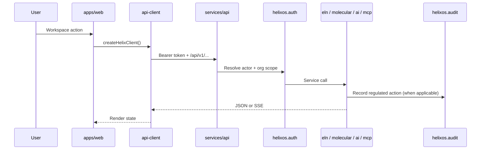
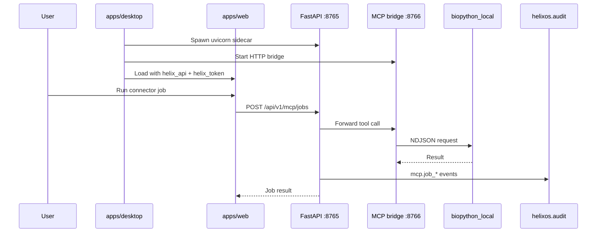

# System Architecture

HelixOS is a modular monorepo for AI-native laboratory software. Start with [docs/OVERVIEW.md](docs/OVERVIEW.md) for MVP scope, then use [docs/README.md](docs/README.md) as the documentation index.

## Runtime Components

| Path | Role | Doc |
| --- | --- | --- |
| `apps/web` | Next.js workspace UI (ELN, sequences, agent, connectors) | [README.md](README.md) |
| `apps/desktop` | Electron shell, API sidecar, MCP bridge | [docs/modules/desktop.md](docs/modules/desktop.md) |
| `services/api` | FastAPI REST + SSE under `/api/v1` | [API_CONTRACTS.md](API_CONTRACTS.md) |
| `packages/api-client` | Typed fetch + SSE client for the web app | — |
| `packages/types` | Shared TypeScript contracts | [SCHEMA_GUIDE.md](SCHEMA_GUIDE.md) |
| `schemas/` | Canonical JSON Schemas | [SCHEMA_GUIDE.md](SCHEMA_GUIDE.md) |
| `mcp/` | Connector manifests and stdio server hosts | [docs/modules/mcp.md](docs/modules/mcp.md) |
| `prompts/` | Agent system prompts | [docs/modules/ai.md](docs/modules/ai.md) |

## Backend Domains

| Domain | Package | Status | Module doc |
| --- | --- | --- | --- |
| Auth | `helixos.auth` | Demo tokens + actor scoping | [auth.md](docs/modules/auth.md) |
| ELN | `helixos.eln` | Experiment drafts | [eln.md](docs/modules/eln.md) |
| Molecular | `helixos.molecular` | Sequence metadata | [molecular.md](docs/modules/molecular.md) |
| AI | `helixos.ai` | Sessions, SSE runs, providers | [ai.md](docs/modules/ai.md) |
| MCP | `helixos.mcp` | Registry + job dispatch | [mcp.md](docs/modules/mcp.md) |
| Audit | `helixos.audit` | Hash-chained events | [audit.md](docs/modules/audit.md) |
| Inventory | — | UI only | Planned — see [OVERVIEW.md](docs/OVERVIEW.md) |
| Biobank | — | — | Planned |
| Workflows | — | — | Planned |

Every domain router is mounted in `services/api/helixos/main.py`.

## Request Flow (browser dev)

Default browser API URL: `http://127.0.0.1:8000` (see `apps/web/.env.local`).

## Request Flow (desktop dev)

See [docs/modules/desktop.md](docs/modules/desktop.md) for ports, preload IPC, and packaging.

## Data Principles

- Every tenant-scoped record includes `organization_id` ([auth](docs/modules/auth.md)).
- Regulated actions append [audit events](docs/modules/audit.md) with per-organization hash chains.
- Long-running scientific jobs should be asynchronous (molecular analysis, external MCP tools).
- Files will use S3-compatible object storage with database metadata (not implemented in MVP).
- Schemas are versioned and backward compatible ([SCHEMA_GUIDE.md](SCHEMA_GUIDE.md)).

## Audit Storage Selection

| `HELIX_DATABASE_URL` | Backend | Typical use |
| --- | --- | --- |
| unset | In-memory | CI, quick API dev |
| `sqlite:///...` | SQLite | Desktop + local dev (`.data/helixos-dev.db`) |
| `postgresql+psycopg://...` | Postgres | Server / docker-compose |

Details: [docs/modules/audit.md](docs/modules/audit.md).

## Agent Principles

Agents and human contributors should:

1. Read [AGENTS.md](AGENTS.md), [API_CONTRACTS.md](API_CONTRACTS.md), and the relevant [module doc](docs/README.md).
2. Make narrow domain changes with tests and contract updates.
3. Record audit implications when adding regulated behavior.

Scaffold new modules with [agents/module_scaffold.md](agents/module_scaffold.md).
